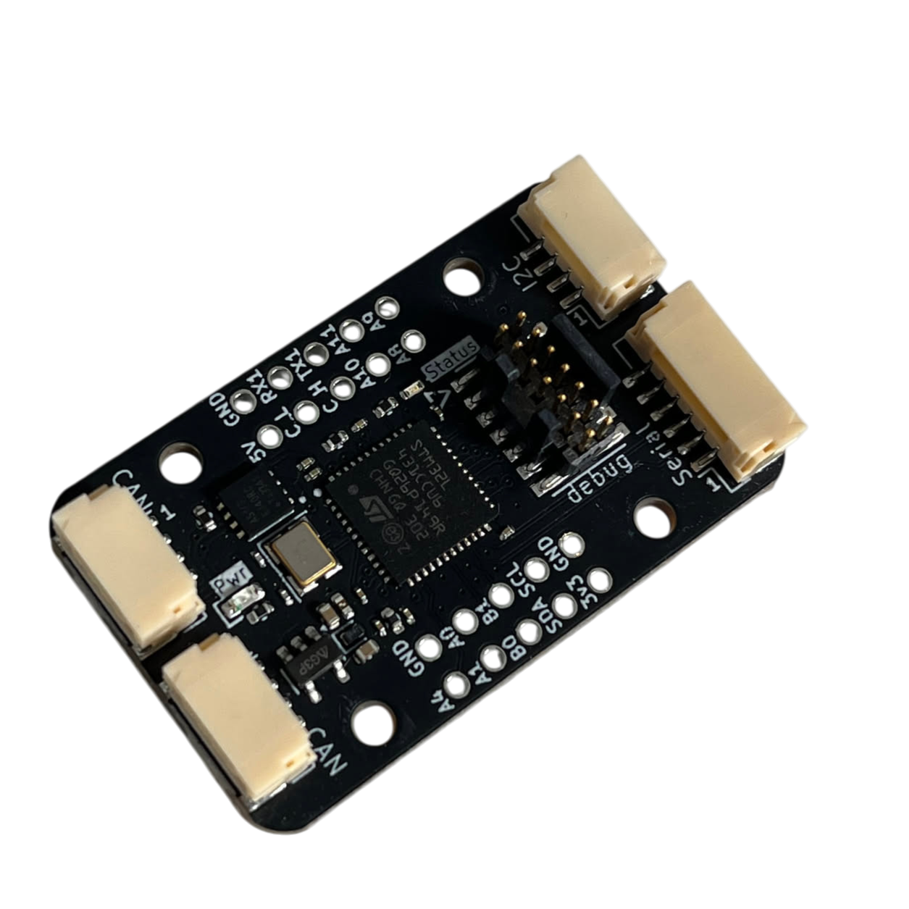
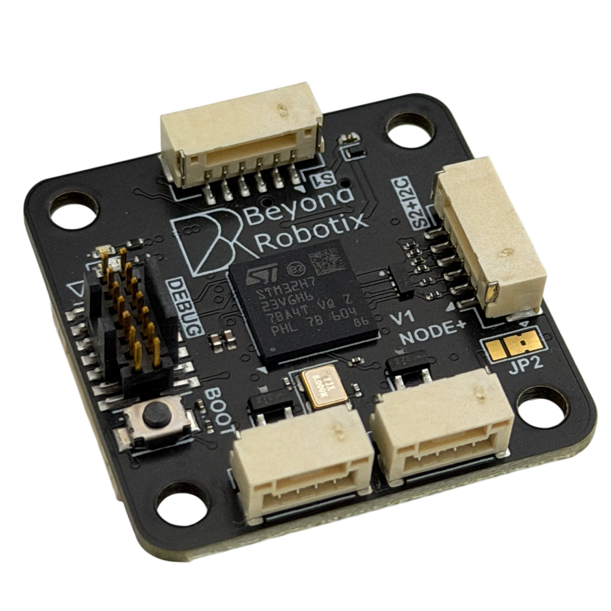

# Arduino DroneCAN

This repository allows easy integration of sensors to be used with Ardupilot and PX4 via DroneCAN. Sensors can be integrated within minutes by using pre-existing Arduino libraries for sensors, and through this library which abstracts the DroneCAN layer so you can focus on sending and receiving messages.

By using the Arduino core and PlatformIO with pre-configured board setups, you can start developing instantly.

This isn't intended to be used in the same way as AP_Periph, which supports a bunch of Ardupilot sensors all at once and is adaptable without writing code. This is intended for writing a DroneCAN interface for any sensor or system, without having to deal with a large code base and lots of boilerplate.

This repo is intended as a quick start project. Clone the project, build the default main.cpp and you're away!

## Features

- Send DroneCAN messages ✅
- Receive DroneCAN messages ✅
- Standard DroneCAN under the hood (allocation, node info) ✅
- DroneCAN Parameters ✅
- Firmware update over CAN ✅
- CANFD 🚦 (under construction)
- Multiple CAN port instances ✅ (only on H7 nodes)

## Code Usage

Apart from calling usual init functions and our library update function, sending a DroneCAN message boils down to this:
```cpp
uavcan_equipment_power_BatteryInfo pkt{};
pkt.voltage = analogRead(PA1);
pkt.current = analogRead(PA0);

sendUavcanMsg(dronecan.canard, pkt);
```

See [Beyond Robotix Gitbooks ArduinoCAN documentation](https://beyond-robotix.gitbook.io/docs/can-node-system/arduino-dronecan) for more information!

We have a big tutorial here which runs through integrating a sensor: [Arduino DroneCAN tutorial](https://beyond-robotix.gitbook.io/docs/can-node-system/arduino-dronecan/thermocouple-tutorial)

## PlatformIO Management

Board definitions, variants, linker scripts, and the bundled bootloader binaries are provided by the [br_platformio_hwdef](https://github.com/BeyondRobotix/br_platformio_hwdef) platform, referenced directly from `platformio.ini`:

```ini
[env]
platform = https://github.com/BeyondRobotix/br_platformio_hwdef.git
framework = arduino
```

PlatformIO fetches the platform on first build — no separate install step. To pick up new changes to the platform, force a refetch with `pio pkg uninstall --platform br-stm32 -g`.

The [libArduinoDroneCAN](https://github.com/BeyondRobotix/libArduinoDroneCAN) library itself is pulled in the same way, pinned to a tag:

```ini
lib_deps = https://github.com/BeyondRobotix/libArduinoDroneCAN.git#v2.0.0
```

## Currently Supported Hardware

This repository is plug and play with the Beyond Robotix CAN node series! Pick the matching PlatformIO environment and build — everything else in the project is the same across boards.

| Board | MCU | CAN | PlatformIO env | Docs |
| ----- | --- | --- | -------------- | ---- |
| [Micro Node](https://www.beyondrobotix.com/products/micro-can-node) | STM32L431, 256 KB flash | 1x Classic CAN | `Micro-Node-App` | [Micro Node](https://beyond-robotix.gitbook.io/docs/can-node-system/micro-node) |
| [CAN Node](https://www.beyondrobotix.com/products/can-node) | STM32L431, 256 KB flash | 1x Classic CAN, 2 connectors for daisy chaining | `Micro-Node-App` | [CAN Node](https://beyond-robotix.gitbook.io/docs/can-node-system/l431-can-node) |
| [CAN Node Plus](https://www.beyondrobotix.com/products/can-node-plus) | STM32H723, 550 MHz Cortex-M7, 1 MB flash | 2x independent CAN FD | `Micro-Node-Plus-App` | [CAN Node Plus](https://beyond-robotix.gitbook.io/docs/can-node-system/can-node-plus) |


### Micro Node

A 26 x 20 mm board-to-board module for building production grade PCBs — put the DF40C-80DS-0.4V(51) connector on your carrier board, wire in your sensor, and you have a CAN enabled project. Also available as a [development bundle](https://www.beyondrobotix.com/products/micro-can-node-development-bundle) with the node carrier board.


### CAN Node

A standalone version of the Micro Node in a 18 x 20 mm standard form factor, with M2 mounting holes, a 2.54 mm breakout header and a debug port (Serial + SWD) for Arduino DroneCAN development.

- 1x CAN interface, pinned out to 2 JST-GH connectors for daisy chaining
- JST-GH Serial and I2C, plus a second serial on the header (note: no onboard I2C pull-ups on v1.0)
- 2.54 mm header with CAN, UART1, I2C, 5 ADCs, 6 PWMs, 5V and 3.3V
- Dioded and fused power input



### CAN Node Plus

Our H7 node, 32 x 32 mm with M3 mounting holes. Two fully independent CAN FD interfaces, much more processing power, and JST-GH connectors following autopilot conventions so standard peripherals plug straight in.

- STM32H723VGHx — 550 MHz Cortex-M7, 1 MB flash
- 2x independent CAN FD interfaces, each with its own transceiver, connector and optional 120 ohm termination jumper
- JST-GH: 2x CAN, Serial 1 with flow control, Serial 2 + I2C in the autopilot GPS pinout, SPI (2 chip selects, 2 data ready lines), 8x PWM
- Onboard I2C pull-ups, input voltage monitoring on `PB1`, and a software switchable 5V peripheral rail (~540 mA limit) on `PA5`
- USB-C, BOOT0 button and SWD + serial debug header
- Power from either CAN connector or USB, each individually fused and OR'd, so the node stays up if one bus loses power



We've got some handy docs for the node hardware and some more software explaination and examples here [CAN node gitbook](https://beyond-robotix.gitbook.io/docs/can-node-system)

## Support

If you get stuck with this repository, the discussions section will allow us to help out.

For dedicated engineering support on your application, contact [admin@beyondrobotix.com](admin@beyondrobotix.com). We can also quote for writing custom firmware for you!
